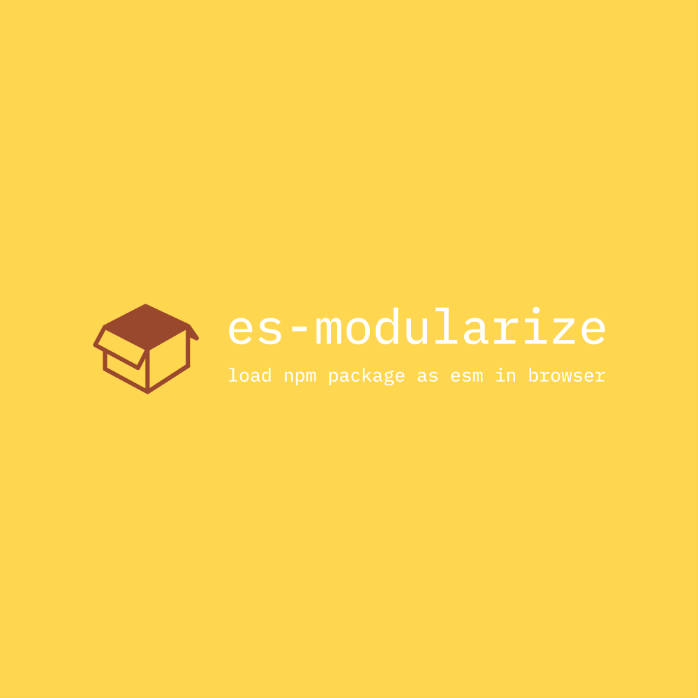

# es-modularize

<div align="center">
  
</div>

> Goodbye, bundlers. Hello, `es-modularize`.

---

[](https://github.com/DarrenDanielDay/es-modularize/actions/) [](https://badge.fury.io/js/es-modularize)

English | [简体中文](./README.zh-CN.md)

A browser only tool for converting `npm` package to `ES module`.

Explore this [online demo](https://darrendanielday.github.io/es-modularize) with `devtools` of your browser to see how this tool resolve, download and load `npm` packages.

## Introduction

Modern browsers support `ECMAScript` module (i.e. `ES Module`) natively, so dependency bundler is actually required for small projects.

This library allows the following code to work directly and correctly in browser thanks to a modern feature `<script type="importmap">`.

```js
// entry.js
import React from "react";
import ReactDOM from "react-dom/client";
```

If you are using a dependency bundler, your output code may change frequently, although the dependency part is completely unchanged in most cases.

With `es-modularize`, you won't need to bundle referenced dependencies in the output code, just working like using external script links – your server will no longer need to consume a lot of traffic for bundled dependent content, and you can spend more of the server traffic on the content of the code you write. You'll also maximize the load acceleration that comes with your browser's default caching policy – the content of externally linked scripts is constant for a long time, although it may take some time to load initially.

Unlike external script links, you can still write code in a modular way — you don't need to worry about a lot of external scripts introducing global variables that cause a lot of confusion.

Unlike the compilers and transpilers, `es-modularize` does not do any parsing and conversion of code. The dependency library code is executed within the browser and the agent's `ES Module` script is generated based on the evaluated export value.

To run the minimal example, you only need a static resource server and can completely leave the NodeJS toolchain alone. The rest of the work will be done within the browser.

Currently only `UMD` and `CJS` packages are supported. For browser `importmap` support, you might need this tool:

<https://github.com/guybedford/es-module-shims>

## Example

First, include this library via external script link:

```html
<script src="https://unpkg.com/es-modularize@latest/dist/browser.bundle.min.js"></script>
```

UMD example:

```html
<!-- define import maps -->
<script>
  ESModularize.build({
    react: ESModularize.load("https://unpkg.com/react@18.2.0/umd/react.development.js").sync().umd("React"),
    "react-dom/client": ESModularize.load("https://unpkg.com/react-dom@18.2.0/umd/react-dom.development.js")
      .sync()
      .umd("ReactDOM"),
  });
</script>
<!-- now module imports works -->
<script type="module" src="entry.js"></script>
```

CJS example:

```html
<script>
  ESModularize.createProjectLoader({
    nodeGlobals: {
      process: {
        env: {
          NODE_ENV: "production",
        },
      },
    },
  })
    .load(
      {
        react: "^18",
        "react-dom": "^18",
      },
      ["react", "react-dom/client"]
    )
    .then((importMap) => {
      ESModularize.build(importMap);
    });
</script>
<!-- now module imports works -->
<script type="module" src="entry.js"></script>
```

## License

```text
 __________________
< The MIT license! >
 ------------------
        \   ^__^
         \  (oo)\_______
            (__)\       )\/\
                ||----w |
                ||     ||
```
