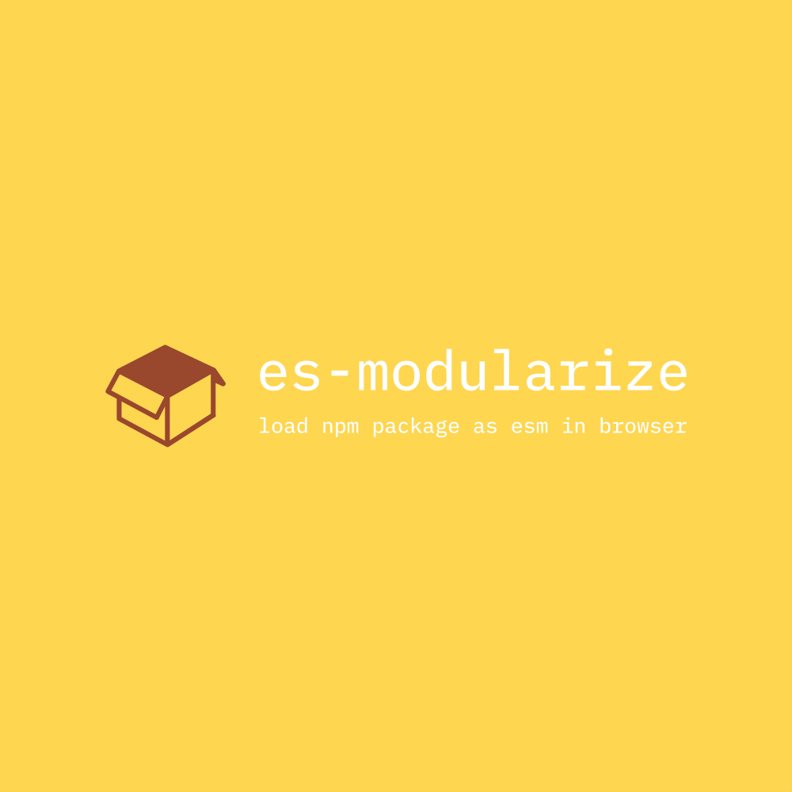

# es-modularize

<div align="center">
  
</div>

> 再见, 打包器。 你好, `es-modularize`。

[](https://github.com/DarrenDanielDay/es-modularize/actions/) [](https://badge.fury.io/js/es-modularize)

[English](../README.md) | 简体中文

一个仅浏览器可用的用于转换`npm`包为`ES module`的工具库。

使用您的浏览器`devtools`来探索此[在线示例](https://darrendanielday.github.io/es-modularize)并了解此工具库如何解析，下载并加载`npm`包。

## 简介

现代的浏览器原生支持`ECMAScript`模块（即 `ES Module`），因此事实上小的项目不需要依赖打包器。

多亏了一个现代的特性`<script type="importmap">`，这个库使得下面的代码可以在浏览器内直接地、正确地运行。

```js
// entry.js
import React from "react";
import ReactDOM from "react-dom/client";
```

如果您正在使用依赖打包工具，您的产出代码可能会经常改变，尽管依赖部分在大多数情况下是完全不变的。

借助`es-modularize`，您将无需在产出代码中捆绑引用的依赖代码，就像外部脚本链接引入一样——您的服务器将不再需要为捆绑依赖的内容消耗大量流量，您可以将服务器流量更多地用在您编写的代码内容上。此外，您还将最大限度地享受浏览器默认的缓存策略带来的加载提速——外部链接脚本的内容是长期不变的，尽管初次加载时还是可能会需要一些时间。

与外部脚本链接引入依赖不一样的是，您仍然可以通过模块化的方式编写代码——您无需担心大量外部脚本引入导致产生大量混乱的全局变量。

和编译转换工具不同的是，`es-modularize`不会做任何代码的解析与转换。引入的依赖代码会在浏览器内被执行，并根据求得的导出值生成代理的`ES Module`脚本。

运行最小的示例，您只需要一个静态资源服务器，完全可以不使用 NodeJS 工具链。剩下的工作，都将在浏览器内完成执行。

目前仅支持 `UMD`和 `CJS`包。对于`importmap`的浏览器支持，你可能需要这个工具：

<https://github.com/guybedford/es-module-shims>

## 示例

首先，通过外部脚本链接引入这个库：

```html
<script src="https://unpkg.com/es-modularize@latest/dist/browser.bundle.min.js"></script>
```

UMD 示例:

```html
<!-- 定义import maps -->
<script>
  ESModularize.build({
    react: ESModularize.load("https://unpkg.com/react@18.2.0/umd/react.development.js").sync().umd("React"),
    "react-dom/client": ESModularize.load("https://unpkg.com/react-dom@18.2.0/umd/react-dom.development.js")
      .sync()
      .umd("ReactDOM"),
  });
</script>
<!-- 现在模块导入可用 -->
<script type="module" src="entry.js"></script>
```

CJS 示例:

```html
<script>
  ESModularize.createProjectLoader({
    nodeGlobals: {
      process: {
        env: {
          NODE_ENV: "development",
        },
      },
    },
  })
    .load(
      {
        react: "^18",
        "react-dom": "^18",
      },
      ["react", "react-dom/client"]
    )
    .then((importMap) => {
      ESModularize.build(importMap);
    });
</script>
<!-- 现在，模块导入可用 -->
<script type="module" src="entry.js"></script>
```

## 许可证

```text
 __________________
< The MIT license! >
 ------------------
        \   ^__^
         \  (oo)\_______
            (__)\       )\/\
                ||----w |
                ||     ||
```
